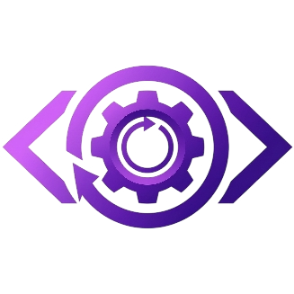

<p align="center">
  
</p>
<div align="center" style="font-size: 2.5em; font-weight: bold; margin-top: -50px;">AutoTaskDK</div>

<p align="center" style="margin-top: -5px;">
  
</p>

## ✨ Key Features

- **🎨 Multi-Theme Premium UI**: Experience a sophisticated "Solid Premium Design" with support for both **Dark** and **Light** modes.
- **🏗️ Visual Task Builder**: Create automation sequences without writing a single line of code. Support for navigate, click, type, select, and more.
- **📁 Project Management**: Organize your automation workflows into projects, making it easy to reload and refine tasks.
- **🎯 Smart Element Picker**: Pick elements directly from your browser to automatically generate accurate CSS selectors.
- **🔗 Seamless Browser Extension**: A dedicated Chrome Extension (Manifest v3) that links your browser tabs to the desktop app via WebSockets.
- **🔌 Manual Disconnect Toggle**: Total control over privacy—pause the automation bridge instantly from the extension popup.
- **📜 Real-time Logs**: Monitor every automation step with detailed, beautifully formatted logs.
- **🌐 Multi-Tab Support**: Execute commands across multiple connected tabs simultaneously.

## 🛠️ Technology Stack

- **Desktop App**: [Electron](https://www.electronjs.org/)
- **Styling**: [Tailwind CSS v4](https://tailwindcss.com/)
- **Communication**: [WebSockets (ws)](https://github.com/websockets/ws)
- **Browser Extension**: Manifest v3 (Background Service Workers)
- **Icons**: [Lucide](https://lucide.dev/) (via SVG/Font)

## 🚀 Getting Started

### 1. Prerequisites
- [Bun](https://bun.sh/) (v1.0 or higher)

### 2. Desktop App Installation
1. Clone the repository:
   ```bash
   git clone https://github.com/DikyAhmad/AutoTaskDK.git
   cd AutoTaskDK
   ```
2. Install dependencies:
   ```bash
   bun install
   ```
3. Build the CSS (requires Tailwind CSS CLI):
   ```bash
   bun run css:build
   ```
4. Run the application:
   ```bash
   bun run dev
   ```

### 3. Browser Extension Setup
1. Open your browser (Chrome/Edge/Brave) and navigate to `chrome://extensions`.
2. Enable **Developer mode** (top right toggle).
3. Click **Load unpacked**.
4. Select the `browser-extension` folder within this repository.
5. Click the extension icon and ensure the toggle is **ON** to connect to the desktop app.

## 🎨 Customization

The app's aesthetic is controlled via `renderer/input.css` using Tailwind v4's `@theme` block. You can easily modify the design tokens to match your brand.

## 📄 License

This project is licensed under the MIT License